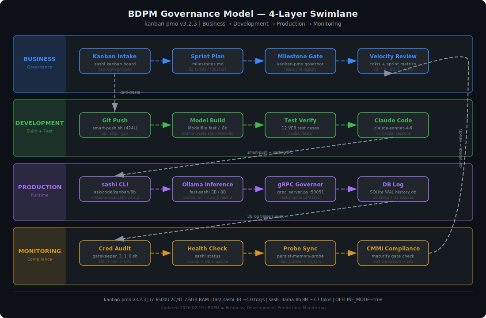
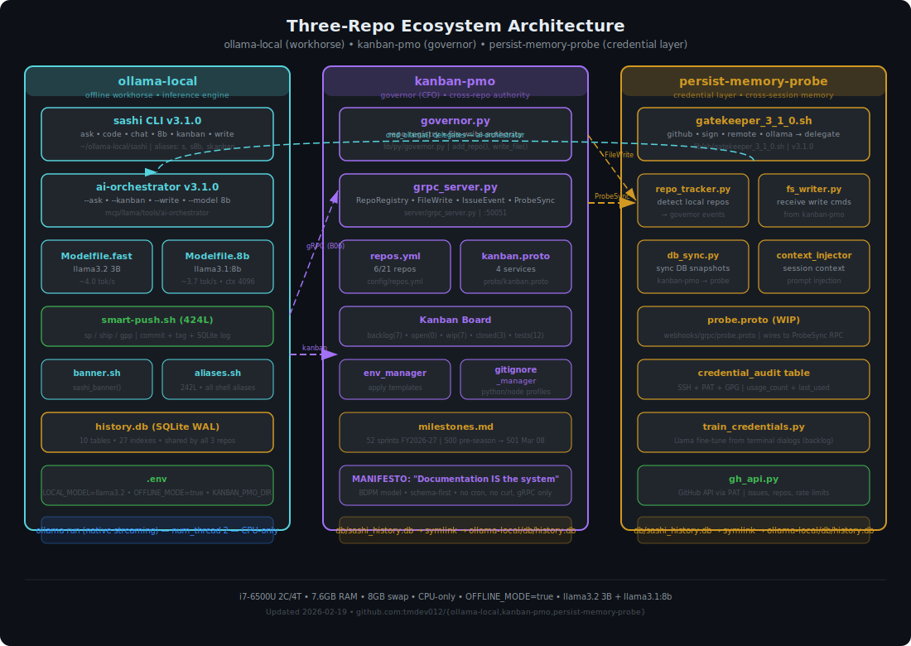

# Kanban PMO

> Task management and project governance layer. Python-based multi-repo framework with gRPC communication, Ollama/Llama integration, Docker orchestration, and SQLite persistence. Symlinked to ollama-local DB for shared state.

[]()
[]()
[]()
[]()

---

## Manifesto

> Documentation is not a description of the system. It IS the system.

See: [`docs/MANIFESTO.md`](docs/MANIFESTO.md) — Core principles, BDPM model, intellectual lineage, and anti-patterns.

---

## Architecture

### BDPM Governance Model



> 4-layer governance: **B**usiness (kanban intake, sprint planning) → **D**evelopment (git, model build, test, smart-push) → **P**roduction (gRPC dispatch, ollama inference, file write, DB log) → **M**onitoring (cred audit, health check, doc sync, CMMI compliance). Cross-lane arrows show event triggers between layers.

### Gazette Architecture



---

## Features

| Component | Description | Status |
|-----------|-------------|--------|
| **CLI** | `gazette` command replacing bash aliases | WIP |
| **API** | FastAPI with rate limiting | WIP |
| **PAT** | Personal Access Token management | WIP |
| **SmartDoc** | Document generation with anonymization | WIP |
| **Kanban** | Task board with CSV/JSON/Docker export | WIP |
| **gRPC** | Multi-repo communication | WIP |
| **Training** | Llama 3.2 fine-tuning on terminal dialogs | Backlog |

---

## Quick Start

```bash
# Clone
git clone git@github.com:tmdev012/kanban-pmo.git
cd kanban-pmo

# Install
pip install -e .

# Or Docker
docker-compose up -d
```

---

## CLI Commands (Planned)

```bash
# AI queries
gazette ask "explain this code"
gazette code "write a sorting function"

# Document generation
gazette doc init "Project Name"
gazette doc tech --from-commits HEAD~5
gazette doc qm --sprint 12

# Git pipeline
gazette push "commit message"
gazette push --version v1.0.0

# Kanban
gazette board show
gazette board add "New task" --priority high
gazette board export --format csv

# Auth
gazette auth add github --name cli-token
gazette auth limits

# Training
gazette training export --format jsonl
gazette training inject --last 50
```

---

## Directory Structure

```
gazette-support-mcp-framework/
├── api/                    # FastAPI REST endpoints
│   ├── routes/
│   ├── middleware/         # Rate limiting
│   └── schemas/
├── auth/                   # Authentication
│   ├── pat/                # Personal Access Tokens
│   ├── oauth/              # GitHub, Google OAuth
│   └── keys/               # SSH, GPG (not committed)
├── cli/                    # Python CLI (gazette)
│   ├── commands/
│   └── utils/
├── db/                     # SQLite databases
├── docker/                 # Docker configs
├── docs/                   # Documentation
│   └── diagrams/           # SVG process maps
├── grpc/                   # gRPC services
│   ├── protos/             # .proto definitions
│   ├── services/           # Server implementations
│   └── clients/            # Client SDK
├── kanban/                 # Kanban board system
│   ├── models/
│   ├── exports/
│   └── views/
├── mcp/                    # Model Context Protocol
│   ├── claude/
│   ├── llama/
│   ├── voice/
│   └── gmail/
├── scripts/                # Shell utilities
├── termux/                 # Termux sync configs
└── training/               # Llama fine-tuning
    ├── dialogs/
    ├── models/
    └── exports/
```

---

## GPG vs SSH Keys

### SSH Keys (You have these)
- **Purpose**: Authentication to remote servers (GitHub, SSH)
- **Files**: `~/.ssh/id_ed25519`, `~/.ssh/id_ed25519.pub`
- **Usage**: `git push`, `ssh user@host`

### GPG Keys (You don't have these)
- **Purpose**: Signing commits and encrypting data
- **What it does**:
  - Signs commits with cryptographic signature (verified badge on GitHub)
  - Encrypts/decrypts files
  - Signs releases and artifacts
- **Not required for**: Basic git operations, API access
- **When needed**: If you want signed commits, encrypted secrets storage

```bash
# Generate GPG key (optional)
gpg --full-generate-key

# Export for GitHub
gpg --armor --export your@email.com

# Sign commits
git config --global commit.gpgsign true
```

---

## PAT (Personal Access Token) vs SSH

| | SSH Key | PAT |
|---|---------|-----|
| **Auth type** | Asymmetric crypto | Bearer token |
| **Best for** | Git operations | API calls, CI/CD |
| **Scope control** | All or nothing | Fine-grained permissions |
| **Rotation** | Manual | Easy, with expiry |
| **Required for** | Git over SSH | GitHub API, gh CLI |

```bash
# Your current setup uses SSH for git
git remote -v  # git@github.com:...

# PAT needed for:
gh api /user  # GitHub CLI API calls
curl -H "Authorization: token ghp_xxx" api.github.com/user
```

---

## Rate Limiting Design

```python
# Token bucket algorithm
RPM_LIMIT = 60       # Requests per minute
RPD_LIMIT = 1000     # Requests per day

# Headers returned
X-RateLimit-Limit: 60
X-RateLimit-Remaining: 45
X-RateLimit-Reset: 1707321600
```

---

## Termux Sync

Bidirectional sync between Linux desktop and Android/Termux:

```bash
# Push to mobile
gazette sync push

# Pull from mobile
gazette sync pull

# Synced files
~/.bashrc
~/.zshrc
~/.bash_history
/storage/emulated/0/  # Termux shared storage
```

---

## 8GB VRAM Optimization (arm64v8)

```yaml
# docker-compose.yml
ollama:
  environment:
    OLLAMA_NUM_PARALLEL: 1
    OLLAMA_MAX_LOADED_MODELS: 1
  deploy:
    resources:
      limits:
        memory: 6G
```

```python
# Model parameters
num_ctx = 2048      # Reduced context
num_predict = 512   # Limited output
temperature = 0.7
```

---

## Backlog Tasks

1. **PAT Management** - Token storage, rate limiting
2. **SmartDoc** - Document generation, anonymization
3. **Python CLI** - Replace bash aliases
4. **gRPC Server** - Multi-repo communication
5. **Kanban System** - Task board with exports
6. **Llama Training** - Fine-tune on terminal dialogs

---

## Sashi v3.2.0 Integration (2026-02-17)

> Kanban-pmo is now integrated with sashi CLI and ai-orchestrator via shared SQLite DB and file-based board.

### Board Structure

```
kanban/
├── backlog/          # 7 cards — future sprint items
├── open/             # 0 cards
├── wip/              # 2 cards — W06 (openrouter), W07 (docs)
├── closed/           # 11 cards — verified complete
├── labels/           # Label definitions
├── tests/            # 12 verification test cases
├── exports/          # CSV/JSON board exports
├── models/           # Data models
└── views/            # Board views
```

### Sprint Calendar

- **Cadence:** 1-week sprints (tools shape time)
- **FY:** 2026-27 (Mar 2026 – Feb 2027)
- **Total:** 52 sprints
- **Current:** S01 — v3.2.0 shipped, gRPC + probe live
- See: `kanban/milestones.md`

### CLI Access

```bash
# Via sashi
sashi kanban board              # Column counts
sashi kanban state              # Full state (files + DB)
sashi kanban backlog            # List backlog cards

# Via ai-orchestrator
ai-orchestrator --kanban board  # Same data, different entry point
```

### Probe Integration

- `persist-memory-probe/lib/sh/gatekeeper_3_1_0.sh` (formerly ai-orchestrator.sh)
- Credential gateway: delegates inference to ollama-local, keeps github/sign/remote routes
- `gatekeeper_3_1_0.sh kanban` delegates to canonical orchestrator

### Shared Shell Libraries

- `ollama-local/lib/sh/banner.sh` — `sashi_banner()` ASCII art, sourced by sashi + ai-orchestrator
- `ollama-local/lib/sh/aliases.sh` — shell aliases (s8b, skanban, etc.) sourced by all tools

### Project Tracking

- `projects/sashi-v3.2.0/tracker.md` — full task breakdown
- `kanban/milestones.md` — FY2026-27, 52 weekly sprints

---

## License

MIT

---

*Scaffolded with Claude Code - Feb 2026 | Last updated: 2026-02-22 | Version: 3.2.0*
